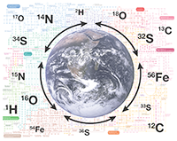

# Logistics

This is the logistics page for the Spring 2018 **Stable Isotope Fractionation** class at the University of Colorado Boulder. Details on reading, homework and project assignments will be filled in throughout the semester. For details on the syllabus see [2018-Stable-Isotope-Fractionation.github.io/syllabus](https://2018-Stable-Isotope-Fractionation.github.io/syllabus).

## Resources

 - [Shared Google Drive](https://goo.gl/yYxMR1) (readings and slides)
 - [RStudio Server](moab.colorado.edu:8787) (IDE for programming exercises, assignments and projects, only accessible on campus or via CU Boulder VPN)
 - [GitHub](https://github.com/) (version control used for all assignments)

### GitHub

For this course we will be making extensive use of the document and code management and collaboration system Git and the online platform GitHub Classroom which is an extension of the popular code-sharing site GitHub. If you've never heard of GitHub, don't panic, absolutely no prior knowledge is necessary and everything will be explained in step-by-step video tutorials posted together with [class assignments](https://2018-Stable-Isotope-Fractionation.github.io/schedule/#assignments). For this course we'll be mostly working with just the core features of GitHub but as you'll see, even just the basics are quite powerful and might come in handy in other classes or your career. If you are already familiar with GitHub, you're of course welcome to keep using whichever tools you like best to work with the platform. For the purpose of keeping access simple, the class will focus on introducing web-based interactions with GitHub that don't require installing any programs on your own computer.

### Computer Access

Most assignments require access to a computer with internet connection outside of class. If you do not have a personal computer, you are encouraged to make use of the computer lab in the Department of Geological Sciences. The computer lab is open M-F from 6:30am to 6pm and available to you unless it is in active use by a computing class. Should you require after-hour access to the computer lab, please send me an email and include the last 7 digits of your BuffOne card number.

## Schedule

The schedule is preliminary and subject to change depending on student selected topics.

Week  | Topic                                                       | Readings
------|-------------------------------------------------------------|------------------------
1     | Logistics; Introduction to isotopes, standards and notation | Coplen 2011; Brand 2014
2     | Isotope effects (types and notation)                        | Hayes 2004
3+4   | Equilibrium isotope fractionation (partition functions)     | Schauble 2004
5+6   | Mass balance and mixing; systematics; reaction networks     | Foster & Rae 2016
7+8   | Metabolic systems, modeling approaches                      | Hayes 2001
9+10  | Example systems (e.g. Dole Effect )                         | Dole 1956
11-15 | Student topics                                              | TBD

## Assignments & Exercises

All assignments are due on the listed due date at the specified time. Details on how to do each assignment will be posted as the assignments become available throughout the semester. Most assignments will be completed on GitHub and will list a link to `Start` once they become available, as well as additional links to relevant video tutorials (if applicable). Detailed assignment information will be provided in the individual assignments' `README.md` files.

| Assignment                         | Due Date                         | How to                                                                                                                |
|------------------------------------|:---------------------------------|-----------------------------------------------------------------------------------------------------------------------|
| Intro GitHub                       | 18 Jan (before class)            | [Video Tutorial](https://youtu.be/bRkpm1LTpkY) / [Start](https://classroom.github.com/a/wAvQp94F)                     |
| Weekly check-in                    | End of week 1                    | [Fill out check-in](https://goo.gl/forms/HRXTCgUi8AwLEMRr1)                                                           |
| Intro RMarkdown                    | 23 Jan (before class)            | [Start](https://classroom.github.com/a/2u8l1Z_E)                                                                      |
| Read Hayes 2004                    | 23 Jan (for class)               | [Google Drive](https://goo.gl/yYxMR1)                                                                                 |
| Intro R (part 2)                   | 25 Jan (before class)            | [Start](https://classroom.github.com/a/fO619WiO)                                                                      |
| Weekly check-in                    | End of week 2                    | [Fill out check-in](https://goo.gl/forms/dlvbqVdMwBC9Pfyv1)                                                           |
| Intro R (part 3)                   | 30 Jan (before class)            | [Start](https://classroom.github.com/a/Xpt8I_bV)                                                                      |
| Intro R (part 4)                   | 1 Feb (before class)             | [Start](https://classroom.github.com/a/ilcAWDFw)                                                                      |
| Weekly check-in                    | End of week 3                    | [Fill out check-in](https://goo.gl/forms/ZnNruk9K5vUvLa802)                                                           |
| Homework 1: Isotope notation & properties      | Feb 8 (end of class)             | [View](https://goo.gl/oA8xk4) / [Start](https://classroom.github.com/a/vXT7DF9e) / [Solutions](https://goo.gl/pe8z1e) |
| Topic suggestions                  | Feb 12 (before class)            | [Add project topic suggestions](https://goo.gl/qhfGYh)                                                                |
| Partition functions (team)         | In class                         | [View](https://goo.gl/eiXDb3) / [Start](https://classroom.github.com/g/VnYn3Zv1) / [Solutions](https://goo.gl/48fQ2s) |
| Weekly check-in                    | End of week 4                    | [Fill out check-in](https://goo.gl/forms/DpMJ29yBCRpExOLj2)                                                           |
| Boron paleo pH                     | In class                         | View / Solutions                                                                                                      |
| Homework 2: Equilibrium isotope effects        | Feb 25                           | [View](https://goo.gl/fpXf7p) / [Start](https://classroom.github.com/a/KbNzai1M)                                      |
| Weekly check-in                    | End of week 5                    | [Fill out check-in](https://goo.gl/forms/F2xC1QXJfUW4Jt9m2)                                                           |
| Rayleigh Exercise                  | In class                         | [View](https://goo.gl/NFPnRT) / [Start](https://classroom.github.com/a/rr0l0l-V) / [Solutions](https://goo.gl/Fq9QZd) |
| Weekly check-in                    | End of week 6                    | [Fill out check-in](https://goo.gl/forms/1vrfugBBX2MTGros1)                                                           |
| Weekly check-in                    | End of week 7                    | [Fill out check-in](https://goo.gl/forms/Y7OKE68nvIznQHhJ3)                                                           |
| Term Project                       | [Sign up](https://goo.gl/qhfGYh) | [Start](https://classroom.github.com/a/0xDO8UM1)                                                                      |
| Project: Dole Effect               | In class                         | [View](https://goo.gl/YRExVL) / [Clone](https://goo.gl/NCcZ5T) / [Solutions](https://goo.gl/LgbzSB)                   |
| Weekly check-in                    | End of week 8                    | [Fill out check-in](https://goo.gl/forms/wq5nUjln7vgNiJPf1)                                                           |
| Project: N cycle OAE2              | In class                         | [View](https://goo.gl/kKJYN8) / [Clone](https://goo.gl/vyC1cN) / [Solutions](https://goo.gl/aQuUrZ)                   |
| Weekly check-in                    | End of week 9                    | [Fill out check-in](https://goo.gl/forms/JmUoJtCV8yFW0Se52)                                                           |
| Project Example: Sulfate Reduction | Optional                         | [View](https://goo.gl/rFz8GQ) / [Clone](https://goo.gl/xDP25c) / [Solutions](https://goo.gl/NKcCsr)                   |
| Project Example: Paleoaltimetry    | Optional                         | [View](https://goo.gl/X5dsyR) / [Clone](https://goo.gl/zc9Z39) / [Solutions](https://goo.gl/ULM2A3)                   |
| Weekly check-in                    | End of week 10                   | [Fill out check-in](https://goo.gl/forms/bnjEEFRjGoZLBSjv2)                                                           |
| Homework 3: Beyond equilibrium                 | April 19                         | [View](https://goo.gl/DgV4db) / [Start](https://classroom.github.com/a/dBWXZBgH) / Solutions                          |
| Project: C3 vs. C4 plants          | In class                         | [View](https://goo.gl/8B4HAP) / [Clone](https://goo.gl/W5nP7t) / [Solutions](https://goo.gl/SMmH9R)                   |
| Weekly check-in                    | End of week 11                   | [Fill out check-in](https://goo.gl/forms/4WQdwD6Ro5Bv4aK33)                                                           |
| Project: evaporation               | In class                         | [View](https://goo.gl/mLWuNm) / [Clone](https://goo.gl/b7pKkz) / [Solutions](https://goo.gl/zyo8ce)                   |
| Weekly check-in                    | End of week 12                   | [Fill out check-in](https://goo.gl/forms/fyzsDp3w4WgAGHQg1)                                                           |
| Project: OMZ carbon cycling        | In class                         | [View](https://goo.gl/gi8NnY) / [Clone](https://goo.gl/ctSqWs) / [Solutions](https://goo.gl/fZysCp)                   |
| Weekly check-in                    | End of week 13                   | [Fill out check-in](https://goo.gl/forms/cbqZ7TjjINPPQo343)                                                           |
| Project: nitrate reduction         | In class                         | [View](https://goo.gl/dAqW91) / [Clone](https://goo.gl/Lsv4rc) / Solutions                                            |
| Weekly check-in                    | End of week 14                   | [Fill out check-in](https://goo.gl/forms/7qcwQdAkkuoyRxWz1)                                                           |
| Project: paleoecology              | In class                         | View / [Clone](https://goo.gl/JomRdL) / Solutions                                                                     |
| Weekly check-in                    | End of week 15                   | [Fill out check-in](https://goo.gl/forms/OLwGFKasPxRGwWtr2)                                                           |
